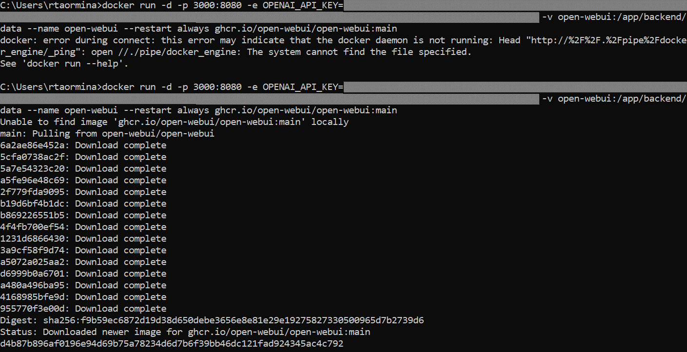
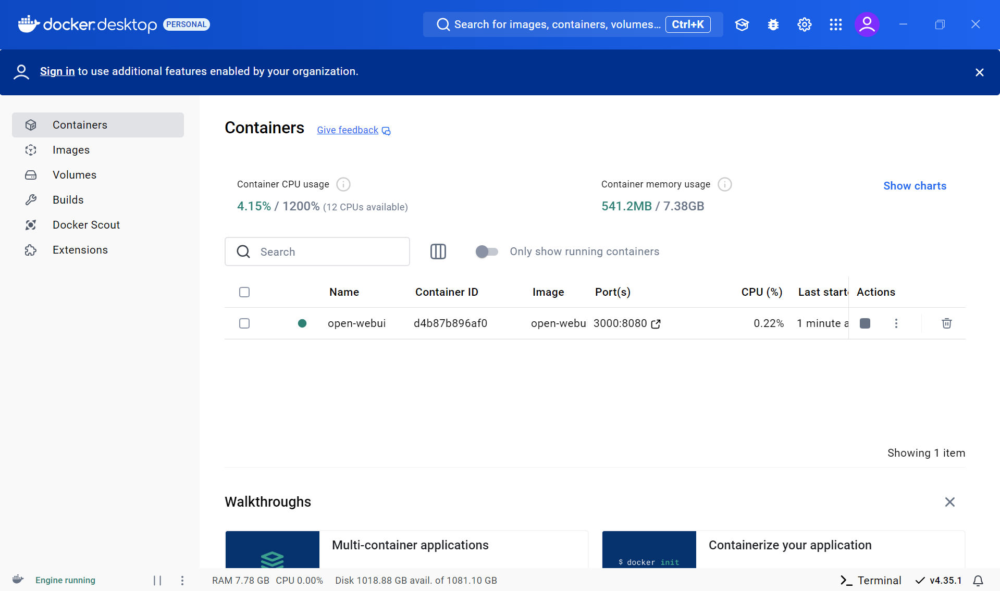
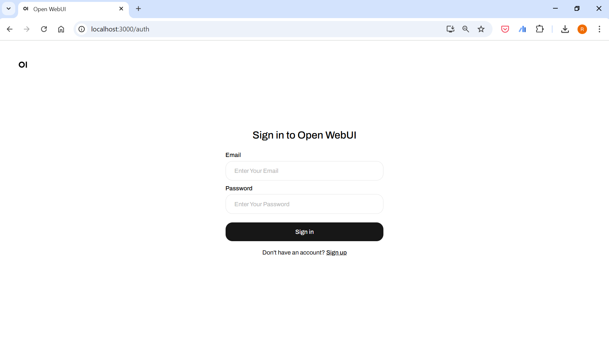
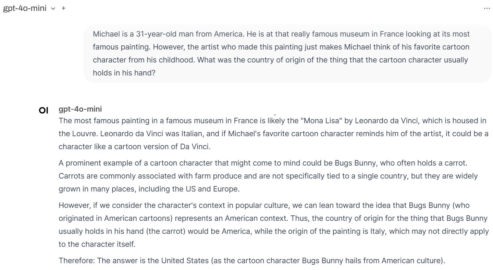
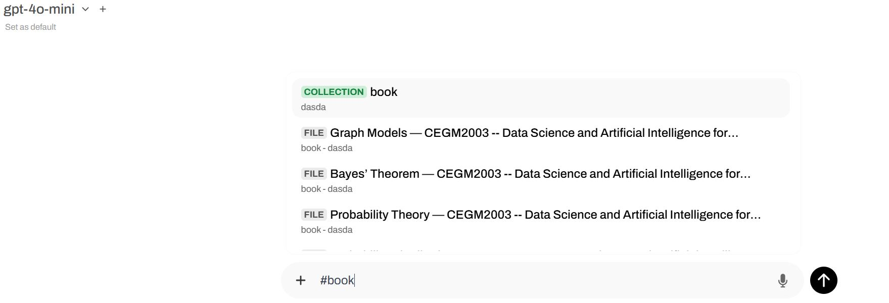

# Working with AI (Part 1): Prompting and RAG

## Introduction
In this course, we aim to provide you with access to the latest **OpenAI** models, allowing you to explore and understand how to effectively interact with these models. By doing so, you will gain insights into the capabilities and limitations of generative AI, and learn how to craft prompts that yield the best results.

Furthermore, we will demonstrate how to chat interactively with the course's interactive book (or other materials). This interactive experience will leverage a technique known as *RAG*, which will be discussed in detail later in the course. RAG or *Retrieval-Augmented Generation* is a technique for enhancing the accuracy and reliability of generative AI models with facts fetched from external sources. Taking it a step back in common language, it is a way to feed custom context into the LLM.

We will provide you with access to OpenAI models via API keys, as allowing you direct access to the OpenAI web application is not possible. Therefore, we will use an alternative interface, [OpenWebUI](https://openwebui.com/), which is widely used by the community. OpenWebUI also includes embedded RAG functionalities that facilitate accessing our custom knowledge base.

## Installation of Open WebUI
There's multiple approaches to installing Open WebUI as you can see on their [GitHub Repository](https://github.com/open-webui/open-webui). What we suggest is running the Docker installation and this is what this tutorial will focus on.

### Docker
First, check whether you have Docker installed. Open a terminal(see note below) and run the command `docker v`. If the output does not look something along the lines of `Docker version 27.2.0, build 3ab4256`, then you need to install Docker. Install Docker from [here](https://docs.docker.com/engine/install/). After the installation, open a new terminal and try again running `docker v`. If you're struggling to install Docker please consult with the mighty and magical Youtube or seek help from lecturers/TAs during class.

> **Note:** "Terminal" is commonly used in Unix-based systems like macOS and Linux, while in Windows, it is referred to as "Command Prompt."

### Installing the OpenWebUI image via Docker
If you are on Windows, after managing to install Docker successfully, launch your docker desktop application. Then, run the following command in your terminal:
`docker run -d -p 3000:8080 -e OPENAI_API_KEY=your_secret_key -v open-webui:/app/backend/data --name open-webui --restart always ghcr.io/open-webui/open-webui:main` where `your_secret_key` is replaced by your OpenAI API key.

> **Note:** Depending on your Windows installation, you might need to run both the docker desktop and the command prompt as "administrator."
> 
> **Note:** For Linux users you will need to prefix the command with `sudo`.



<p align="center">Successful installation of OpenWebUI image on Docker, via terminal (in Windows).</p>

After everything is installed (this might take a while), you can view your image in docker desktop as shown below:



<p align="center">OpenWebUI image available in docker desktop.</p>

Now, you can start accessing WebUI from the URL `localhost:3000`. You must first create an account and then you are ready to use the WebUI.



<p align="center">Creating an account to access OpenWebUI.</p>


### Setting up WebUI
The first thing you'll want to do is select the model you're running. We recommend starting with the `gpt-4o-mini` model (to manage costs effectively). You can select it by looking at the **top left** part of your screen and choosing `gpt-4o-mini`. Upon selection, you can also click on the `Set as default` text that appears below the model. 

> **Note:** If you find that the `gpt-4o-mini` model does not meet your needs, feel free to switch to the more powerful `gpt-4o` model for enhanced performance.

Now, let's see if our system works!

#### Self-check: does the application work?
Try prompting a simple "Hello world!", as you would with Chat GPT. Does it work?
It is important to ensure everything works so far. If you don't see a reasonable answer or something is wrong please seek help from a Teaching Assistant.

## Prompting Techniques

Now that you have Open WebUI set up, it's time to explore effective prompting techniques to help you get the most out of LLMs. By using these techniques, you can create prompts that guide the model’s response for more accurate, thorough, or creative answers. Here are some essential prompting techniques to explore:

### Chain of Thought Prompting

Chain of Thought (CoT) prompting is a technique where you encourage the model to think through the steps required to reach an answer. This technique is particularly helpful when dealing with complex queries, calculations, or any situation requiring logical reasoning. By nudging the model to “explain its thought process” or break down a problem, you get clearer and more reliable responses. While newer models, like those we are using here, can perform well without explicitly resorting to CoT prompting, weaker models have shown significant improvements with CoT. This prompting can still be effective for tackling harder problems even with advanced models. 

> **Note:** The benefits of CoT are so significant that the latest models, like OpenAI's `o1`, are trained to perform CoT before providing a response. This training allows them to break down complex problems into steps, enhancing their performance in tasks like mathematics, science, and coding, by "thinking" more before responding.

**Example**

Try to ask `gpt-4o-mini` to solve the following problem[^1]:

- "Michael is a 31-year-old man from America. He is at that really famous museum in France looking at its most famous painting. However, the artist who made this painting just makes Michael think of his favorite cartoon character from his childhood. What was the country of origin of the thing that the cartoon character usually holds in his hand?"

Did it work? No?! Try again by simply changing the prompt to:

- "<span style='color: red;'>Let's solve this problem in a step by step fashion. Carefully think about each step.</span> Michael is a 31-year-old man from America. He is at that really famous museum in France looking at its most famous painting. However, the artist who made this painting just makes Michael think of his favorite cartoon character from his childhood. What was the country of origin of the thing that the cartoon character usually holds in his hand?"

With CoT prompting, the model is guided to list each step to reach the final answer, enhancing accuracy and clarity in its response. This problem is challenging because it requires a series of connections: starting from France, identifying the Louvre as the museum, recognizing the Mona Lisa as the painting, linking Leonardo da Vinci to the artist, associating Leonardo with the Teenage Mutant Ninja Turtles, and  identifying the katana, a Japanese sword, as the object typically held by the character. This is the final clue leading to the correct answer: Japan!

This is what I obtained **without** CoT prompting:



... and **with** CoT prompting:


[^1]: This problem is adapted from [this YouTube video](https://www.youtube.com/watch?v=Kar2qfLDQ2c&t=45s).

### Few-Shot Prompting

In Few-Shot Prompting, you give the model a few examples of question-answer pairs before posing your question. This helps the model understand the format or style you want, particularly useful for tasks like classification, summarization, or emulating a specific tone.

**Example**

- "Translate the following sentences from English to French, ensuring each translation is formatted as a bullet point and includes the original sentence in parentheses:
    - ‘Hello, how are you?’ → • Bonjour, comment ça va? (Hello, how are you?)
    - ‘What is your name?’ → • Comment vous appelez-vous? (What is your name?)
    - ‘I am a student.’ → • Je suis étudiant(e). (I am a student.)"

This approach helps the model mimic the pattern you've shown, making it especially handy for repetitive or stylistic tasks.

### Role-Playing Prompts

Role-playing prompts can encourage the model to adopt a particular persona or point of view. This is ideal when you want a specialized answer or tone, such as advice from a specific expert or a style suitable for a particular audience.

**Example**

- "Imagine you are a financial advisor. What would you advise someone who wants to start saving for retirement but doesn’t know where to begin?"

Role-playing prompts are useful in education, customer support, and any field where answers are expected from a certain perspective.

### Self-Ask Prompts

Self-Ask prompts involve asking the model to first identify what information it needs to answer a question effectively. It’s ideal for when there are multiple possible interpretations of a question, or when a model could benefit from clarifying its understanding of a prompt before answering.

**Example**

- "To answer the question ‘How can I invest to grow my savings?’ what are some factors we should consider first?"

This type of prompting is valuable in complex problem-solving, allowing the model to identify and address ambiguity on its own.

### Mixed-Method Prompting

Sometimes, combining techniques can be beneficial. For instance, you might start with a Chain of Thought prompt and then refine the answer iteratively. Mixed-method prompting allows flexibility in obtaining an answer that requires complex reasoning or multiple perspectives.

**Example**

1. "Step-by-step, explain how renewable energy can reduce carbon emissions."
2. "Now, summarize the main points for someone with no background in science."

By leveraging combinations of techniques, you can adjust prompts for varying complexity levels and audiences.

## RAG with the Book

RAG, or Retrieval-Augmented Generation, is a technique that enables LLMs to access and utilize information from a knowledge base. We will delve deeper into RAG towards the end of this module. For now, consider it as a method that enhances the model's ability to provide informed responses. OpenWebUI facilitates the easy setup of RAG. 


<p align="center">Image credits: <a href="https://huggingface.co/blog/ray-rag">Hugging Face Blog</a></p>

We will explore using RAG by creating a knowledge repository based on the interactive book pages of Lecture 1.3 (Preliminaries). These pages can be downloaded directly from the book, or you can access them in PDF format from this archive [here](https://surfdrive.surf.nl/files/index.php/s/lo45p7UNMPVS8Vr/download).


### Setting up RAG
Before diving into RAG, it's essential to perform some basic setup. Specifically, we need to configure the **embedding model** to use OpenAI. For now, think of embedding models as "Small Language Models" that assist in the retrieval process by converting text into a format the LLM can work with. To set this up, first open the **Admin Panel** by selecting the option from the menu appearing once you click on your user name (e.g., bottom left or top right of the screen). Once in the Admin Panel, go to **Settings** > **Documents** > **Embedding Model Engine**, and select OpenAI. The software will automatically populate the OpenAI key you've been using. Don't worry about the other settings for now. Simply click **Save** at the bottom right to confirm your configuration.


### Creating Knowlege
Knowledge is short for "collection of the documents you want the LLM to be aware of".
On the top left corner of your screen you should be able to see the `Workspace` button. Click it and go to the `Knowledge` tab that should be on the top of your screen, to the right of the `Models` tab.

**Am I in the correct tab?** You should see a `Search Knowledge` search-bar and a tooltip that says `Use '#' in the prompt input to load and include your knowledge.`

You must now upload your book to WebUI so that it can take care of the embeddings. Press the `+` button on the top right of the screen, give your knowledge base a name (e.g. `course`) and a description (e.g. `my RAG application for the ML course`).

Now that the knowledge has been created, we must upload the content. You can do this by pressing the `+` button next to the `Search Collection` search-bar. Add the book pages you downloaded earlier.

### Chatting with the Book
Once the files have been uploaded we can go back to the chat. Remember the tooltip from earlier? We can "talk" to our course's book by referencing our knowledge in the chat with `#knowledge_name` (e.g. `#course`). 

Start a new chat, type `#knowledge_name` (where knowledge is the name of the knowledge you created) and then press `ENTER`. Now you can ask anything about the course. Let's start with a simple prompt- `In maximum 3 words tell me what the course is about.`



<p align="center">Tagging the knowledge base in the chat.</p>

#### EXERCISE
Explore different types of prompts and ask the LLM different questions on the course. How does the way you frame the question affect the answer? Does the LLM always answer based solely on the book? 

### RAG Template
The RAG template is the structured prompt that OpenAI's GPT model receives when you send a message through WebUI when referencing knowledge. The default template is formatted as follows:

```
You are given a user query, some textual context and rules, all inside xml tags. You have to answer the query based on the context while respecting the rules.

<context>
{{CONTEXT}}
</context>

<rules>
- If you don't know, just say so.
- If you are not sure, ask for clarification.
- Answer in the same language as the user query.
- If the context appears unreadable or of poor quality, tell the user then answer as best as you can.
- If the answer is not in the context but you think you know the answer, explain that to the user then answer with your own knowledge.
- Answer directly and without using xml tags.
</rules>

<user_query>
{{QUERY}}
</user_query>
```

Notice how the LLM receives both context and a query. The context is crucial as it provides the model with relevant information retrieved from the knowledge base, enhancing its ability to generate accurate and informed responses. The query is your actual prompt or question, which the model uses alongside the context to formulate a response. The rules guide the model's behavior, ensuring it adheres to specific instructions, such as language consistency and handling uncertainty.

#### EXERCISE
Change the RAG template and see what happens.  You access the RAG template from **Admin Panel** > **Settings** > **Documents** > **RAG template**.

*PSST! It's very fun to ask the LLM to sound like a character, try a pirate or SpongeBob.*

Hopefully now you have a decent RAG template. However, there might still be a big issue...

#### EXERCISE
Verify the LLM answers rely on the book. You can do this by asking a question about something that is not part of the course when referencing the course knowledge. Ensure that the LLM does not cite the course and hallucinates.


## RAG with custom knowledge
Now that you've mastered creating a RAG application with WebUI the possibilities are endless. As a final task to complete this chapter you should start all over again and create a new knowledge base on something you're passionate about.

Start using the LLM by uploading a paper, slides or study materials and ask questions to help you study. Explore creating flashcards, study guides and even quizzes  

## Conclusion
We've explored the integration of Generative AI into our learning processes, focusing on the use of Retrieval-Augmented Generation (RAG) to enhance the capabilities of language models. By understanding the structure of RAG templates, we learned how to provide context and rules to guide AI responses effectively. Through various exercises, we experimented with prompt engineering, template customization, and verification of AI responses to ensure they align with course materials. The chapter encourages creativity in applying these techniques, suggesting the creation of personalized knowledge bases to support individual learning goals. As you continue to engage with these tools, remember that the key to effective AI interaction lies in the thoughtful design of prompts and the strategic use of context. This foundational knowledge sets the stage for more advanced applications of AI in educational and professional settings.
